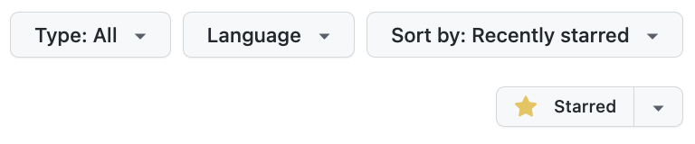
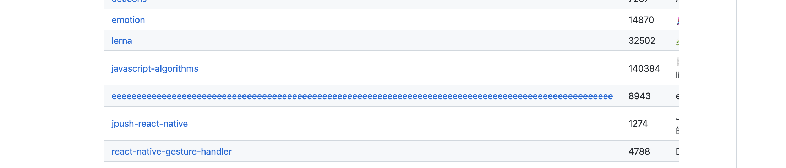
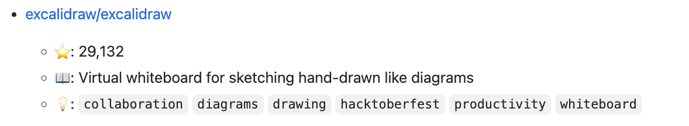
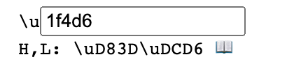
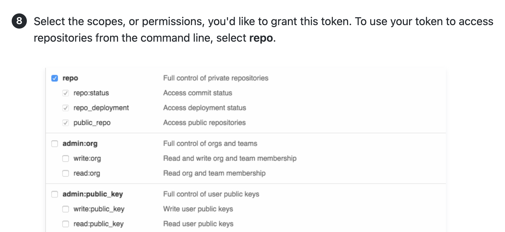
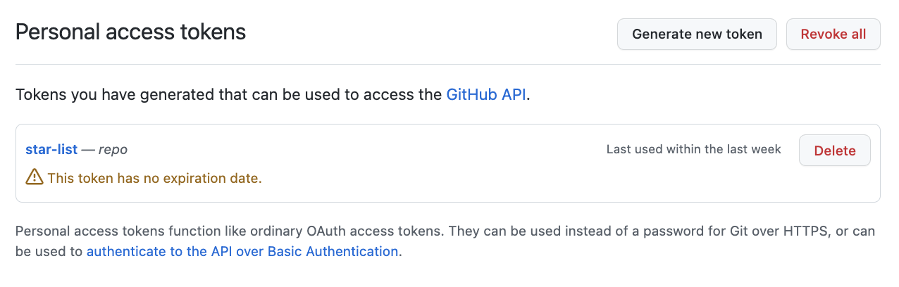

源代码在 [https://github.com/Cygra/star-list](https://github.com/Cygra/star-list)，fork 之后改改 `.github/workflows/main.yml` 里的参数就能直接用哈，欢迎 star / fork。

---

以下正文：

<del>众所周知：</del>
<span onMouseOver="this.style.background='white'" onMouseOut="this.style.background='var(--color-text)'" style="background: var(--color-text); transition: 0.3s">
书买过就算读过，repo 点过 star 就算看过源码。
</span>

不知不觉在 Github 上已经点了四百多个 star，各种各样的 repo 都有。
但是，Github 网页上的 star 列表太难用了，筛选框只有 Type、language 筛选和排序，也没有分页器。



[新增的 List 功能](https://docs.github.com/en/get-started/exploring-projects-on-github/saving-repositories-with-stars#organizing-starred-repositories-with-lists)（现在是 public beta 状态）对于整理 star 过的 repo 也帮不上什么忙。
想来想去，最方便的还是调 Github API 拿到 star 过的 repo 自己处理一番。

说干就干，这个事情简单拆解下来大概就是以下几步：

1. 新建一个 repo 用来渲染 star 过的 repo 列表
2. 脚本

   1.1. 获取所有 star 过的 repo

   1.2. 根据获取到的所有 repo 生成 markdown 文件

   1.3. 调 api，把前面新建的 repo 里的文件更新为新生成的 markdown 文件

3. 定时任务，每周执行一次脚本

## 技术调研

新建一个 repo 这个就不用说了，这里我新建的 repo 是 `star-list`，生成的 markdown 内容直接放 `README.md` 文件。
明确了要做的事情，下面就是查文档了，一个一个来：

### 1. 脚本

新建一个路径，然后执行 `npm init -y`，初始化一个 npm 项目。

因为要发起网络请求，所以再安装一个 axios。
这里选择 axios，其实也是因为这个是 node.js 文档的[官方推荐](https://nodejs.dev/learn/making-http-requests-with-nodejs)。

```
npm i axios
```

后面代码都在 `index.js` 里实现，调试的时候直接执行 `node index.js` 即可。

### 2. 获取所有 star 过的 repo

很简单，这个接口甚至没有鉴权，文档链接：[List repositories starred by a user](https://docs.github.com/en/rest/activity/starring#list-repositories-starred-by-a-user)。

```
curl \
  -H "Accept: application/vnd.github.v3+json" \
  https://api.github.com/users/USERNAME/starred
```

对应的 node.js 代码：

```javascript
const { data } = await axios.get(
  `https://api.github.com/users/Cygra/starred?per_page=100&page=1`
)
```

但是这个接口有分页处理，一次最多只能获取 100 个，所以写了一个递归，一直获取到最后一页为止：

```javascript
const getFullList = async (page, data) => {
  const list = data || []
  const p = page || 1

  const { data: result } = await axios.get(
    `https://api.github.com/users/Cygra/starred?per_page=100&page=${p}`
  )

  list.push(...result)

  if (result.length < 100) {
    return list
  }
  return await getFullList(p + 1, list)
}
```

返回的数据里后面用到的有：
|字段|描述|
|---|---|
|`full_name`| repo 名称，格式是 `${owner_name}/{repo_name}`<br/>另外有一个 name 字段，仅有 `repo_name`|
|`html_url`| repo 对应的网页链接 |
|`description`| repo 的 description |
|`stargazers_count`| star 数字 |
|`topics`| repo 的 topic，可以理解为关键字 |

### 3. 根据获取到的所有 repo 生成 markdown 文件

这一步其实也比较简单，主要就是拼接字符串。

尝试了一下用 Markdown 的 Table 表格，但是有一些 repo 的名称特别长（比如
[这个](https://github.com/eeeeeeeeeeeeeeeeeeeeeeeeeeeeeeee/eeeeeeeeeeeeeeeeeeeeeeeeeeeeeeeeeeeeeeeeeeeeeeeeeeeeeeeeeeeeeeeeeeeeeeeeeeeeeeeeeeeeeeeeeeeeeeeeeeee)
），渲染成 Table 之后不能自动换行，效果有点鬼畜。



也尝试过在超出某一长度后强制换行（加一个 `<br />`）或截断（加 `...`），但是感觉都不优雅。

最后还是选择了无序列表。对于列表中的每一项（每一个 repo），生成对应条目的内容，代码：

```javascript
const getDisplay = ({
  full_name,
  html_url,
  description,
  stargazers_count,
  topics,
}) => {
  const result = [
    `- [${full_name}](${html_url})`,
    `  - \u2B50: ${stargazers_count.toLocaleString()}`,
    `  - \uD83D\uDCD6: ${description}`,
  ]
  if (topics.length) {
    result.push(`  - \uD83D\uDCA1: ${topics.map(it => `\`${it}\``).join(" ")}`)
  }

  return result.join("\n") + "\n"
}
```

生成的一个 Markdown 示例，包含名称（链接）、星星数、描述、topics：

```markdown
- [excalidraw/excalidraw](https://github.com/excalidraw/excalidraw)
  - ⭐: 29,132
  - 📖: Virtual whiteboard for sketching hand-drawn like diagrams
  - 💡: `collaboration` `diagrams` `drawing` `hacktoberfest` `productivity` `whiteboard`
```



这里怕代码里直接放 emoji 会有问题，所以直接放了 emoji 对应的 unicode。
没想到还是遇到了问题，有些 emoji 的 unicode 是 5 位（而不是 4 位），例如 [ `\u1f4d6` 📖](https://unicode.org/emoji/charts/full-emoji-list.html#1f4d6)。

这其实是因为随着 unicode 字符的不断增多，原有的 4 位已经不能满足需求，这种表示称为代理对，参见：[UTF-16](https://zh.m.wikipedia.org/zh-sg/UTF-16)、[What is a "surrogate pair" in Java?](https://stackoverflow.com/questions/5903008/what-is-a-surrogate-pair-in-java)。

针对这个问题找到了一个[工具](http://www.russellcottrell.com/greek/utilities/SurrogatePairCalculator.htm)，可以在这两种表示之间相互转换：



<h3 id="4">4. 接口鉴权 </h3>

下一步就是更新刚才新建的用来展示 star 列表的 repo 中的文件了。
虽然获取所有 star 过的 repo 的接口没有鉴权，但是更新文件的接口不用看也能知道，肯定是需要鉴权的。

看看 Github 文档怎么说：

> While the API provides multiple methods for authentication, we strongly recommend using OAuth for production applications.

但是这个 OAuth 属实有点麻烦了哈，我们就只调一个接口，还是来点简单的，这里我找到了 [Basic Authentication](https://docs.github.com/en/rest/overview/other-authentication-methods#basic-authentication)。
这种鉴权方式只需要 Github 用户名和一个 token，这个 token 是 Github 的 person access token，生成方式可以见[Creating a personal access token](https://docs.github.com/en/authentication/keeping-your-account-and-data-secure/creating-a-personal-access-token)。
因为只需要更新指定 repo 中的文件，所以 scope 这里只选 repo 就行：



生成的 token 会展示在生成成功的页面上（只展示一次所以赶紧复制，保存好），后面再进来的时候这个页面长这样：



现在用户名和 token 都有了，具体怎么调接口在下面说。

### 5. 调 api，把前面新建的 repo 里的文件更新为新生成的 markdown 文件

这一步对应的 Github 接口文档：[Create or update file contents](https://docs.github.com/en/rest/repos/contents#create-or-update-file-contents)。

接口文档里提供的 curl 是：

```bash
curl \
  -X PUT \
  -H "Accept: application/vnd.github.v3+json" \
  https://api.github.com/repos/OWNER/REPO/contents/PATH \
  -d '{"message":"my commit message","committer":{"name":"Monalisa Octocat","email":"octocat@github.com"},"content":"bXkgbmV3IGZpbGUgY29udGVudHM="}'
```

可以看到，主要是 `message`、`committer`（`name` 和 `email`）、`content` 几个参数。
但是这里不是把内容直接塞到 `content` 里那么简单。

1. 首先，接口文档里提到，更新一个文件时，必须传入要更新的文件的 sha，所以还要有一个接口先拿到要更新的文件的 sha。
   这个在 [Get repository content](https://docs.github.com/en/rest/repos/contents#get-repository-content) 接口的 sha 字段。
   其实和更新内容的接口的 path 是一样的，只是请求方法不同，更新是 `put`，这个是 `get`。

2. 要更新的文件的内容是以 base64 形式传入的，生成 base64 字符串的方法：`Buffer.from(${content}).toString("base64")`。

3. 鉴权。刚才已经拿到了 user 和 token，怎么在 axios 里实现鉴权呢？

> curl 的鉴权方式：
>
> ```bash
> $ curl -u username:token https://api.github.com/user
> ```

这个可以在 axios 的[文档](https://github.com/axios/axios#axiosposturl-data-config-1)中找到，是在传入参数（`axios.post(url[, data[, config]])`）的 `config` 部分：

```javascript
axios.post(url, data, {
  auth: {
    username: "janedoe",
    password: "s00pers3cret",
  },
})
```

此处，username 即为 Github 的 username，password 就是[前面](#4)获取到的 Github Person Access Token。

更新文件内容的完整代码：

```javascript
await axios.put(
  FILE_PATH, // https://api.github.com/repos/${USER}/${REPO}/contents/${FILE_NAME}
  {
    headers: {
      Accept: "application/vnd.github.v3+json",
    },
    sha: (await axios.get(FILE_PATH)).data.sha,
    message: "Update by script",
    committer: {
      name: USER,
      email: EMAIL,
    },
    content: Buffer.from(data.map(getDisplay).join("\n")).toString("base64"),
  },
  {
    auth: {
      username: USER,
      password: GITHUB_PERSON_ACCESS_TOKEN,
    },
  }
)
```

🎉 现在基本的代码都有了，在本地已经能跑起来了，执行 `node index.js` 应该可以看到，对应的 repo 中的 README.md 文件已经更新了。

下面，我们来解决定时执行脚本的问题。

https://docs.github.com/en/actions/using-workflows/events-that-trigger-workflows
https://docs.github.com/en/actions/creating-actions/creating-a-javascript-action#testing-out-your-action-in-a-workflow
https://docs.github.com/en/actions/security-guides/encrypted-secrets#creating-encrypted-secrets-for-a-repository
https://docs.github.com/en/actions/using-workflows/triggering-a-workflow#using-filters-to-target-specific-paths-for-pull-request-or-push-events
