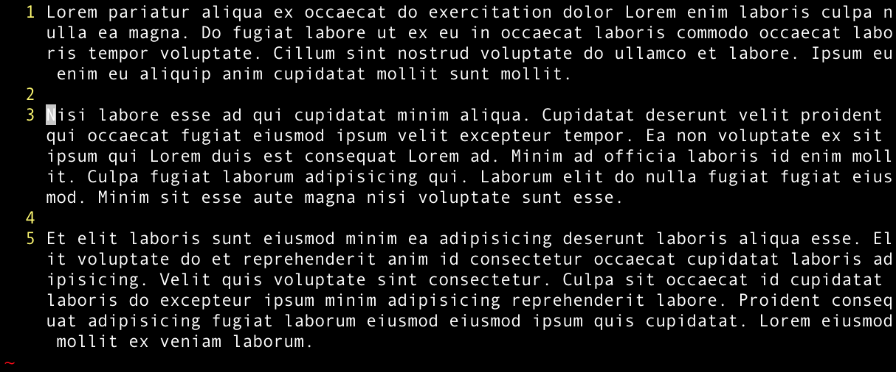

是之前发布在 https://github.com/Cygra/blog （已 Private）和掘金上的一系列文章，重新整理发在这里。

1. [Vim 系列 - 看完这篇文章，明天 all in Vim](#1)
2. [Vim 系列 - Vim 进阶 - 剪切（删除）、复制、粘贴与寄存器](#2)
3. [Vim 系列 - Vim 进阶 - 移动和跳转](#3)
4. WIP [Vim 系列 - Vim 进阶 - 宏和宏的应用](#4) 

<h2 id="1">Vim 系列 - 看完这篇文章，明天 all in Vim</h2>

网上对 Vim 的说法往往是「学习曲线陡」、「入门门槛高」，等等。很多人也因此在对 Vim 稍有了解之后就对 Vim 望而却步，怕影响工作效率或者认投入相比产出不划算而没有真正走进 Vim 的大门。

确实，Vim 不像其他编辑器一样上手即用，但是也远没有那么可怕。花个一晚上时间熟悉最基础的十来个命令，在你常用的编辑器上装一个 Vim 插件，例如 [vscodevim](https://marketplace.visualstudio.com/items?itemName=vscodevim.vim)、[IdeaVim](https://plugins.jetbrains.com/plugin/164-ideavim)，Vim 就算入门了。

读完这篇入门文章，花个把小时时间熟悉一下本文中的操作，然后回到你平常写代码的地方，放下普通的编辑器，用 Vim 来编辑，你会发现，转向 Vim 的第一天，工作效率并没有降低，甚至可能反而略有提升。

Vim 的大门就此打开，之后的学习曲线平缓而温和， edit text at the speed of thought！

新建一个文本文件并填充一些没有用的代码或者文本，这里将是你练习 Vim 操作的地方。

在终端中用 `vim` 打开这个文本文件，或者通过前面提到的插件激活编辑器的 Vim 模式并打开这个文件。

强烈建议你边看本文边操作，操作的过程也是记忆的过程，看完本文基本你已经记了个七七八八，很多命令马上就可以信手拈来了。

### 开始

现在，我们处在 Vim 的**普通模式**。

### 普通模式

普通模式下无法直接通过打字输入的方式对文本进行编辑，但是可以移动光标，或是执行一些命令。

普通模式是 Vim 的默认模式，也是 Vim 最自然放松的状态，这也是 Vim 和其他编辑器不同的地方。

随着对 Vim 了解的深入，你逐渐就会知道 Vim 为什么是这样的。

### 移动光标

在 Vim 中，我们可以通过 `j↑` `k↓` `h←` `l→` 四个按键来移动光标。

`j` `k` `l`正好在右手的食指、中指、无名指下面，手掌不用移动就能按到。

`h` 在右手食指左边的一个位置，刚刚接触 Vim 的时候可能会觉得不方便，但是掌握了本文下面提到的一些命令，以及一些更加复杂的操作之后你就会发现，需要连续按超过一次 `h` 或 `l` 的操作，大部分都可以通过其他命令实现。使用最多的，也就是 `jk` 上下两个。

### 插入模式

在普通模式下按 `i` 就进入了插入（**i**nsert）模式。

插入模式下的 Vim 和普通的编辑器差不多，用方向键移动光标，键盘输入打字。

学会了移动光标和最简单的打字输入，你已经可以用最基础的方式进行文本编辑了。

但是，Vim 强大的功能此刻还完全没有露头，下面要讲的，才是让 Vim 可以进行高效文本编辑的所在。

### 移动光标的更多操作

前面提到的 `hjkl` 一次只能让光标移动一个字符，而下面这些操作可以让光标跳跃移动。

`b` `w` 分别移动到前、后单词的开头，代表 **b**ackward，forward one **w**ord 。

`e` `ge` 分别移动到后、前单词的结尾，代表 **e**nd。

`0` `$` 分别移动到行首和行尾。

`^`（`shift 6`）和 `0` 相似，但是是移动到当前行的第一个非空字符。

| 命令             | 用途                                |
| ---------------- | ----------------------------------- |
| `b`              | **移动**到当前/上一个单词的**开头** |
| `w`              | **移动**到下一个单词的**开头**      |
| `e`              | **移动**到当前/下一个单词**结尾**   |
| `ge`             | **移动**到上一个单词**结尾**        |
| `0`              | 行首                                |
| `$`              | 行尾                                |
| `^`<br />`<⇧ 6>` | 第一个非空白字符                    |

### 删除

下面来看一下删除的操作。

`x` 可以删除光标下的字符，`X` 删除光标前面的字符。

`d` 在 Vim 中代表 **d**elete 删除，Vim 中的删除通过按 `d` 再加要删除的范围来实现。

删除的范围可以看下面这个表格。

`d` 加方向键可以删除对应方向上的一个字符（上下方向则删除一行）。

顺带一提，在 Vim 的普通模式下先输入数字 `n` 再输入命令，即可执行 n 次命令，例如 `d5j` 就表示向下删除 5 行。

前面提到的按单词移动光标和移动到行尾行首的命令，也可以指定删除的范围，例如 `db` 删除光标起始到单词开头，`d$` 从光标位置删除到行尾。

连按两次删除， `dd` 命令可以删除整行。同样，也可以用数字加命令的方式一次删除多行。

此外，还有等于 delete a word 的 `daw` ，删除一个单词，和 delete n words 的 `d{n}w`，删除多个单词。

| 命令    | 用途                               |
| ------- | ---------------------------------- |
| `dh`    | 删除前一个字符（`d←`）             |
| `dl`    | 删除一个字符（等同于 `x` or `d→`） |
| `d5j`   | 删除 5 行                          |
| ----    | ------------------------           |
| `db`    | 删除光标起始到单词开头             |
| `d$`    | 从光标位置删除到行尾               |
| ----    | ------------------------           |
| `dd`    | 删除 1 行                          |
| `{n}dd` | 删除 n 行                          |
| ----    | ------------------------           |
| `daw`   | 删除一个单词                       |
| `d{n}w` | 删除 n 个单词                      |

### 花样进入插入模式

前面提到的 `i` 只是简单地在当前光标所在的位置进入插入模式，而 Vim 提供了一些命令让我们可以更快地移动到目标位置并插入。

`a` 代表 **a**ppend 追加，会在**当前光标位置的后面**进入插入模式。

在普通模式下按 `o`，会在光标当前所在的行**下面创建一个新行**并进入插入模式，代表 **o**pen。

`s` 会**删除**当前光标下的字符并进入插入模式。

这三个命令还分别有与之匹配的大写命令，实现相似的操作。

`A` 会在**当前行的末尾**进入插入模式，`O` 会在当前行的**上面**创建一个新行并进入插入模式，`S` 会**删除整行**并进入插入模式。`i` 也有与之匹配的 `I`，在当前行的第一个非空字符处进入插入模式。

| 命令 | 进入插入模式的位置       |
| ---- | ------------------------ |
| `a`  | 在当前**光标之后**       |
| `A`  | 在当前**行的结尾**       |
| `i`  | 在光标位置               |
| `I`  | 当前行的第一个非空字符处 |
| `o`  | 在**下**面**插入新行**   |
| `O`  | 在**上**面**插入新行**   |
| `s`  | **删除光标下的字符**     |
| `S`  | **删除整行**             |

### 撤销操作

不小心删除了不该删除的文本怎么办？在 Vim 中，`u` 代表 **u**ndo，可以撤销最近的一次操作。

### 命令模式

如果你是在终端当中用 `vim` 命令进行编辑，那你可能经常要和 Vim 的命令模式打交道。

按 `:` 进入 Vim 的命令模式，输入命令再按回车即可进行相应的操作。

`:w` 代表 **w**rite，`:q` 代表 **q**uit。

命令也可以一次输入多个，例如 `:wq` - 保存并退出。

命令后加 `!` 代表强行执行，例如 `:q!` - 不保存而强行退出。

### All in Vim!

现在，你已经掌握了最基本的插入、删除和撤销操作，足以应付简单的日常工作了。

下一篇文章，我们来介绍一些进阶操作，让你的 Vim 更上一层楼。

<h2 id="2">Vim 系列 - Vim 进阶 - 剪切（删除）、复制、粘贴与寄存器</h2>

Vim 和其它编辑器一样，也有剪切、复制、粘贴等操作，但是在 Vim 中这些操作都有不同的名字：删除 delete、复制 yank、粘贴 put。

一般的编辑器在进行复制、剪切等操作时，会使用操作系统的剪贴板 clipboard 来暂时存储文本，而 Vim 的「剪贴板」和系统的剪贴板并不互通，Vim 使用内建的「寄存器 register」来保存文本。

## 剪切（删除）、复制、粘贴操作

### 剪切（删除）Delete

在其他编辑器中，剪切一般代表着删除一段文本的同时，将这段文本保存到剪贴板中，以便在其他地方粘贴出来。而在 Vim 当中，剪切和删除并没有明显的界限，因为在 Vim 中，**所有被删除的文本都会被放到寄存器中**，这样我们在下次想使用的时候可以直接粘贴。

具体放到哪个寄存器里了，以及寄存器的操作方法，我们稍后再说。先来看看 Vim 中和剪切 / 删除相关的命令：

| 命令        | 用途                               |
| ----------- | ---------------------------------- |
| `c{motion}` | 删除字符并进入插入模式             |
| `cc`        | 删除整行并进入插入模式（=== `S`）  |
| `C`         | 从光标处删除到行尾并进入插入模式   |
| `d{motion}` | 删除字符并进入插入模式             |
| `dd`        | 删除整行                           |
| `D`         | 清除当前行的所有字符（不会删除行） |
| `s`         | 删除光标下的字符并进入插入模式     |
| `S`         | 删除整行并进入插入模式（=== `cc`） |
| `x`         | 删除光标下的字符                   |
| `X`         | 删除光标前面的字符                 |

在 Vim 里，`c` 代表 **c**hange，d 代表 **d**elete。

简单来讲，`c` 和 `s` 相关的命令在删除字符后会进入插入模式，而 `d` 和 `x` 在删除之后会留在普通模式。`c` 和 `d` 可以删除成段字符，而 `s` 和 `x` 只删除一个字符。

`c{motion}` 和 `d{motion}` 中的 `{motion}` 代表**动作命令**，关于动作命令的更多内容可以参考[这一篇](#3)。例如：`ciw` - 删除当前单词并进入插入模式，`dt"` - 删除到 `"` 前边，`di]` - 删除 `[]` 内包括的内容，等等。

除动作命令外，也可使用可视模式选中文本后用 `c` 或 `d` 进行删除。

另外，还有方便的 `cc` 和 `dd` 命令可以用来直接删除整行。

### 复制 Yank

在 Vim 中，yank 代表复制。Yank 本来的意思是拉起、拉出。使用 yank 代表复制主要是因为在 Vim 开发的时候 c 已经被 change 占用了，所以只能用还空余的 y 了。

`y` 命令的使用方式和 `c`、`d` 类似，`y{motion}` 可以对复制相应文本，也可以在可视模式下选中文本后用 `y` 复制。

和 `cc`、`dd` 类似，`yy` 可以复制整行。

### 粘贴 Put

`p` 可以把刚刚删除 / 剪切 / 复制的文本放（**p**ut）在光标后面。如果是整行的文本，则放在光标下面的行。而 `P` 是放在前 / 上面。

在可视模式下，`p` 会在粘贴的同时**替换**选中的文本。

此外，还有 `gp` 和 `gP` 命令，和 `p` `P` 不同的是，前两个命令会在粘贴之后，把光标的位置移到文本的结尾而不是开头。

## 寄存器 Register

看到这里，我们已经学到删除 / 剪切 / 复制的一些一本操作，能应付很多日常场景了。

但是设想这样的场景：

我想复制一处的文本 a，并替换另一处的文本 b。我用 `y` 复制了文本 a，然后把光标移动到文本 b 上，选中或者使用动作命令搭配 `d` 删除了文本 b，然后按 `p`。

奇怪的事情发生了，我们得到的并不是文本 a，而是把文本 b 粘贴（put）了出来。**糟糕，我把复制的内容弄丢了！**

当然你可能会说，复制文本 a 之后，选中文本 b 而不删除，直接用 `p` 即可完成替换。确实如此，这也是我更倾向的操作，它不会既复制又删除，只用两步操作就完成了替换。

而要弄懂为什么会 put 出文本 b，就要了解寄存器的概念。

### 什么是寄存器

一般来讲，操作系统的剪贴板只有一个，后来的会覆盖先来的。新的内容被存到剪贴板的同时，老的内容也会被删除。

Vim 的寄存器不太一样，寄存器有很多个，可以通过 `"{reg}` 的方式指明要使用的寄存器。其中，`"` 用来告诉 Vim，要进行和寄存器有关的操作，而 `{reg}` 代表寄存器的名字。

寄存器的名字可以是 `[a-z0+"*#%.:/]` 等，其中 `[a-z]` 共 26 个可供我们随意使用，另外的那些是 Vim 内置的专用寄存器。

### 使用寄存器

使用 `"{reg}` 加命令可以指明我们想要使用的寄存器，例如 `"ep` - 粘贴寄存器 e 中的内容，`"fdd` - 删除当前行并放到 f 寄存器中，等等。

### 无名寄存器（默认）`""`

当没有指定要使用的寄存器时，Vim 会使用无名寄存器 `""`。

前面提到，`c`、`d`、`s`、`x`、`y` 命令都会将相应的文本放到寄存器中，而没有声明 `[a-z]` 中的某一个时，这段文本就会被放到默认的寄存器 `""` 中。而当我们使用 `p` 进行粘贴的时候，也会读取 `""` 中的内容。

这就是**糟糕，我把复制的内容弄丢了！** 的原因。当我们执行删除操作的时候，删除的文本替换了 `""` 中的内容，也就是我们刚刚复制的文本 a。

所以，正如我们刚刚提到的，在 Vim 当中剪切和删除并没有清晰的界限，被删掉的文本也会默认被放到无名寄存器 `""` 中，而这有可能会覆盖我们刚刚复制的内容，在使用的时候一定要注意这一点。

当然，我们也可以利用 Vim 的这个特点。例如：

`xp` 可以删除光标下的字符再把它放到光标后面，也就是**交换了光标下面两个字符的位置**。

`ddp` 可以删除当前行，并把这行粘贴在光标下面，也就是**交换了光标下面的两行**。

### 有名寄存器 `"[a-z]`

Vim 提供了完整的 26 个英文字母供我们命名寄存器，这意味着我们可以同时剪切/复制 26 段文本。

使用大写字母命名寄存器，会将相应的内容添加到相对应的小写字母命名的寄存器后面。

### 复制专用寄存器 `"0`

当使用 `y` 进行复制时，复制的文本不仅会被存进无名寄存器 `""`，也同时会被存进 `"0`，而 `c`、`d`、`s`、`x` 均不会覆盖这个寄存器。只有当我们下一次复制的时候，这个寄存器才会被覆盖。

所以，也可以使用这个寄存器来规避**糟糕，我把复制的内容弄丢了！** 的问题。

### 系统剪贴板寄存器 `"+`

前面提到 Vim 使用的寄存器和操作系统的剪贴板是相互隔离的，但是这个隔离也不绝对，使用 `"+` 寄存器可以和系统剪贴板进行交互，例如，我们可以通过 `"+p` 粘贴系统剪贴板的内容，也可以用 `"+y` 把内容存进系统剪贴板。这意味着我们可以在 Vim 中直接复制文本，然后到其他程序中粘贴。

### 其他

此外，Vim 还提供了一些其他的寄存器供我们使用，这些寄存器也被称为**只读**寄存器：

| 寄存器 | 内容           |
| ------ | -------------- |
| `"%`   | 当前文件名     |
| `"#`   | 轮换文件名     |
| `".`   | 上次插入的文本 |
| `":`   | 上次执行的命令 |
| `"/`   | 上次查找的模式 |

<h2 id="3">Vim 系列 - Vim 进阶 - 移动和跳转</h2>

相信你已经知道了 `hjkl` 的含义，如果不知道的话，[看这里](#1)。

## `hjkl` 也可以更快！

在这里我（不带任何倾向性地）假设你使用的是 MacBook，打开 `系统偏好设置 > 键盘`，把「按键重复」和「重复前延迟」都调整到最快。

「按键重复」决定了当你长按某一个按键的时候系统会以多快的速度重复输入这个按键，「重复前延迟」决定了当你开始长按多久过后系统会开始重复输入。把这两个选项都调到最快，可以让光标的移动更快。

但是，仅靠长按这四个按键来移动，是非常初级、低效、应该被避免的操作。如果你已经决定用 Vim 来进行文本编辑却还用这种方式移动光标，人民群众会仇恨你，你的朋友和家人也会嘲笑你，唾弃你<sup>[^](https://git-scm.com/book/zh/v2/Git-%E5%88%86%E6%94%AF-%E5%8F%98%E5%9F%BA)</sup>。

## 什么是屏幕行

如果你使用的是现代 ide 的 Vim 模式，那么在屏幕左侧应该已经有行号标识了。如果你是在终端当中使用 Vim，你可能需要 `:set number` 命令打开行号显示。



如图所示，光标现在在第 3 行开头 `_N_isi` 位置，此时我们按下 `j`，光标移动到了第四行，而不是 `Nisi` 下面的 `qui`。这是因为 `jk` 是按照实际行，也就是文本在文档中真实的行，进行移动的。而当一行文本的长度超过的窗口的宽度，Vim 会把这一行折行显示，文件中的一行可能会显示成屏幕上的若干行。

在 Vim 中想要按屏幕行上下移动（本例中从 `_N_isi` 移动到 `qui`），可以用 `gj` 和 `gk` 命令。

移动到行首和行尾的 `0` 和 `$` 命令同样也有屏幕行和实际行之分，按屏幕行的首尾移动，可以使用 `g0`、`g$`。

## 基于单词的移动

| 命令 | 移动位置                                    |
| ---- | ------------------------------------------- |
| `w`  | 到下一个单词的开头 - for**w**ard / **w**ord |
| `b`  | 到当前单词、上一个单词的开头 - **b**ackward |
| `e`  | 到当前单词、下一个单词的结尾                |
| `ge` | 到上一个单词的结尾                          |

> `ea` 连在一起可以实现「移动到当前单词结尾并在后面插入」，记住它，使用频率很高。

## 查找字符

`f{char}`、`F{char}`、`t{char}`、`T{char}` 这四个命令是 Vim 中进行查找/移动最快的方式，可以分别记忆为 **f**ind、**t**ill。

其中，`f{char}` 代表移动光标到当前行的下一个 `{char}`，而 `t` 代表移动光标到当前行的下一个 `{char}` 的前面一个字符。与这两个命令对应的大写，`F{char}`、`T{char}`，则分别代表向前查找。

例如，`fo` 代表将光标移动到当前行的下一个 `o`。

想要查找再下一个、第二个第三个 `o`，并不需要再按一次 `fo`，Vim 为我们提供了重复这步操作的命令：`;` 表示向下继续寻找，`,` 表示向上继续寻找。

而这几个命令的用处不仅仅在于移动光标，配合 `d` delete、`c` change、`v` visual、`y` yank 也非常好用。

例如，`dtn` 可以理解为「从当前光标删除到下一个 `n` 之前」，可以简单记忆为「delete **t**ill n」。`ctm` 可以理解为 「从当前光标删除到下一个 `n` 之前并进入插入模式」，亦即「change **t**ill m」。`vfa`，「从当前光标位置选中到下一个 a」，`yfa`，「从当前光标位置复制到下一个 a」。

实践上，在和 `d`、`c` 一起使用时，倾向于用 `tT`，而在其他移动或者和 `v`、`y` 一起使用时，倾向于用 `fF`。

但是，`fFtF` 也有局限性：只能寻找一个字符，且只能在当前行寻找。

| 命令       | 移动位置                                 |
| ---------- | ---------------------------------------- |
| `fF{char}` | 移动到上/下一个 `{char}`                 |
| `tT{char}` | 移动到上/下一个 `{char}` 的前/后一个字符 |
| `,` `;`    | 向前/后移动                              |

## 跨行文本查找

在 Vim 中可以用 `/{char}⏎` 来进行多字符、跨行的查找，类似于在 ide 中按下 cmd + f 之后输入 `{char}` 并按回车的效果。

与之匹配的前一个/后一个的命令是 `N/n`（**n**ext），大写向前，小写向后。

## 标记

有的时候，我们可能要在两个位置间来回跳转。这个时候，最方便的办法就是使用「标记」。

`m{a-zA-Z}` 会用紧跟着输入的字母标记当前光标所在位置，例如 `ma` 把当前位置标记为 `a`。标记好之后，当我们移动到另外一个地方的时候，只要两个键就能跳转回来。

跳转回来有两种方式，以刚刚提到的标记 `a` 为例，`'a` 会跳转到标记的所在行的第一个非空白字符，而 `` `a `` 不仅会跳转到标记所在行，还会定位到标记所在的确切位置，也就是标记所在的列。

大多数时候，只要反复使用 `mm` 和 `` `m `` 就可以方便地来回跳转了。

Vim 还提供了一些默认的标识供我们跳转，见下表：

| 命令     | 跳转到                         |
| -------- | ------------------------------ |
| ` `` `   | 当前文件上次跳转动作之前的位置 |
| `` `. `` | 上次修改的地方                 |
| `` `^ `` | 上次插入的地方                 |
| `` `[ `` | 上次修改或复制的起始位置       |
| `` `] `` | 上次修改或复制的结束位置       |
| `` `< `` | 上次高亮选区的起始位置         |
| `` `> `` | 上次高亮选区的结束位置         |

## 括号内的跳转和选中

代码中经常有圆括号、尖括号、方括号、引号、html 标签等内容，Vim 也有一系列命令可以对和括号等内容相关的文本进行操作，在 Vim 中，我们把这些命令操作的内容称作「文本对象」。

文本对象由两个字符组成，第一个字符永远是 `i` 或 `a`。可以把 `i` 想象成 **i**nner 或者 **i**nside，而把 `a` 想象成 **a**round。下面，用一些例子来讲解文本对象的具体用法。

| 命令  | 选中范围                             |
| ----- | ------------------------------------ |
| `vi]` | 选中方括号包围的内部                 |
| `va]` | 选中方括号包围的内容，**包括**方括号 |
| `vi"` | 选中双引号包围的内部                 |
| `va"` | 选中双引号包围的内容，**包括**双引号 |
| `vat` | 选中一对 html 标签                   |
| `vit` | 选中 html 标签内部                   |


同样，文本对象也可以搭配 `d` delete、`c` change、`y` yank 命令进行操作，例如：`da"` - 删除一对双引号及之间的内容（delete **a**round "），`cit` - 修改一对 html 标签之内的内容。

`i`、`a` 还可以搭配上面提到的 `w` 使用，例如：`diw` 删除当前单词，`diw` 删除当前单词及后面的空格，搭配 `c`、`v`、`y` 也类似。

## 括号间的跳转

`%` 命令让我们可以在匹配的括号间来回跳转。这个命令无需我们手动指明要跳转的括号，而是自动根据当前光标所在位置的上一层括号来进行跳转。

<h2 id="4">Vim 系列 - Vim 进阶 - 宏和宏的应用</h2>

## 什么是宏

宏让我们可以在 Vim 中重复进行特定的修改。在 Vim 中，我们可以把任意的按键操作录制并存储到某一个[寄存器](./VimRecipe_DYP&reg.md)中，用于之后的回放。

要使用宏，首先要录制一个宏，也就是输入一系列命令，同时也将这一系列命令存储在某个寄存器里。这一系列命令就是我们录制的宏，也是我们之后要重复执行的操作。

输入可能会出错，或是有修改，我们可以直接修改某个宏，也可以把这个宏复制到一个文档里进行修改。

宏的执行有串行也有并行，后面我们会详细说明这两种方式的差异。

我们也可以在宏里声明变量、进行简单的运算，来实现更为复杂的重复性操作。

在这篇教程中，我们通过实现一个简单的目标来学习宏。

假设我们有这样一段代码：

```json
{
  "foo": "bar.1.1",
  "foo": "bar.1.1",
  "foo": "bar.1.1",
  "foo": "bar.1.1",
  "foo": "bar.1.1",
  "foo": "bar.1.1"
}
```

我们想把这段代码中每一行的第一个 `.` 替换成 `-`，该怎么用宏来实现这样的操作呢？

## 录制宏

录制一个宏主要使用 `q` 命令，这个命令既代表开始，也代表结束。

### 开始录制

使用 `q{reg}` 命令开始录制一个宏，`reg` 代表我们要存储这个宏的寄存器，例如，`qq` 就表示我们要开始录制一个宏，并将这个宏保存在寄存器 `q` 中。

回到前面提到的小目标，如果我们想替换光标当前行的第一个 `.`，应该进行的操作是 `0f.r-`，让我们把这个操作存储到寄存器 `q` 中：

```
qq0f.r-
```

### 结束录制

这时，我们发现第一行的 `.` 已经被替换成了 `-`，宏也被录制到了寄存器 `q` 中。

随后按 `q`，就结束了这个录制，回到了普通模式。

## 宏的执行

`@{reg}` 可以执行指定寄存器当中的宏，也可以用 `@@` 来执行最近执行的上一个宏。

之前我们把宏录制到了寄存器 `q` 中，现在，我们可以用 `j` 把光标移动到下一行，然后按 `@q`。

我们执行了之前的宏，现在，第二行的第一个 `.` 也被正确地替换了。

想要替换下面几行的 `.`，只需要多执行几次 `j@@` 就可以啦。

### 并行执行

Vim 也可以并行地在多个行上同时执行某个宏。

先把刚刚的操作撤销，把 `-` 恢复回 `.`。

按 `VG` 选中从当前行到末尾的所有行，然后输入 `:normal @q`，我们就会发现，之前录制的宏在所有选中的行上都同时执行了一遍。

是的，`:normal @{reg}` 就是并行执行宏的命令，它会指示 Vim 在选中区域的每一行上执行指定的宏。

## 宏的追加和编辑

### 追加

在前面串行执行宏的过程中，我们发现每一次执行之前，都要用 `j` 把光标移动到下一行，这也是一步重复操作，当然也可以录制到宏中。

刚才，我们把宏录制到了寄存器 `q` 中，这次，可以使用大写的 `Q`，意思是我们要向寄存器 `q` 中追加内容。追加的操作：

```
qQjq
```

回到刚才要修改的文本，执行一次 `@q`，可以发现，Vim 在执行完替换之后也将光标向下移动了一行，这说明我们没有破坏或者丢失之前录制的宏，而追加的 `j` 也生效了。

宏的执行也支持指定次数，例如，执行 `5@q` 便可以将寄存器 `q` 中的宏重复执行 5 遍。

但是，我们可能不知道到底还有多少行，怎么办呢？

简单来讲，可以随便输入一个很大的数，比如 `22@q`，（因为 `2` 和 `@` 对应同一个按键），来让宏尽可能多地执行。

Vim 在串行地执行宏的时候，如果遇到了错误，会停止执行。

在上面的例子中，当 Vim 执行到最后一行（只有一个 `}`）时，因为没有 `.`，无法完成替换，Vim 也就会在这里停止执行，而不是真的执行 22 遍。

### 编辑

除了追加之外，还想对宏进行一些其他编辑应该怎么做呢？

前面我们把宏录制到了一个寄存器中，这个寄存器和我们进行复制、删除等操作时的寄存器一样。当我们录制一个宏时，Vim 会把我们录制的一系列操作在寄存器中存储为一段文本。

对宏进行编辑，基本的思路就是把这个寄存器中的文本粘贴出来，编辑，然后存回寄存器。

以刚刚录制到寄存器 `q` 中的宏为例：

```
# 把寄存器 q 中的内容 put 出来
"qp

# 编辑复制出的文本

# 从行首到行尾复制到寄存器 q 中
"qyy

# 删除这行文本（因为它现在没有用了）
dd
```

<!-- https://vim.fandom.com/wiki/Macros#Editing_a_macro -->

## 宏的迭代和累加
